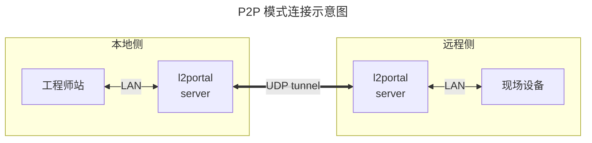
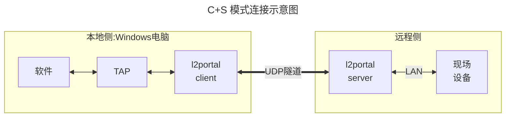
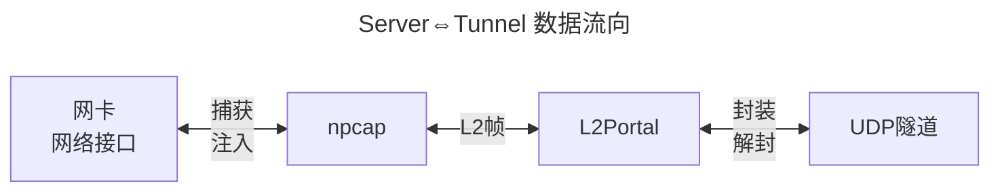
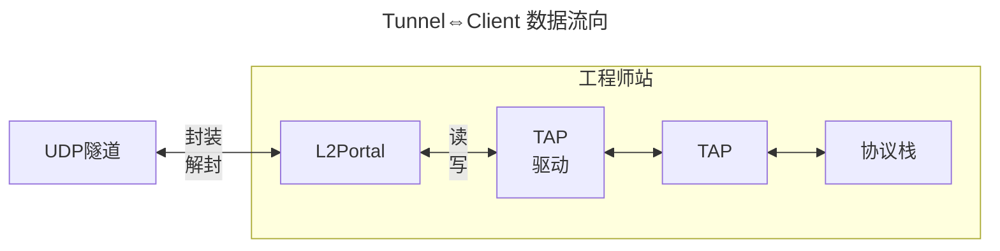
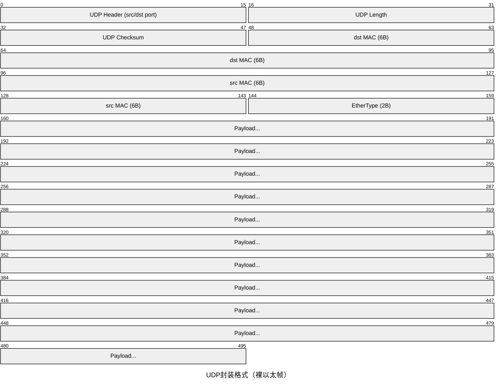
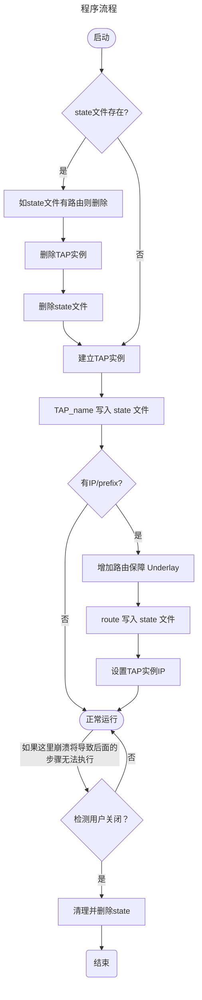

# L2Portal 设计文档

## 1. 背景与目标

开发一个轻量的二层 UDP 隧道工具，将两个网段通过 UDP 隧道透明桥接，使隧道两端的设备能够像接在同一台交换机上一样通讯。

### 指引

- **轻量优先**：无加密、无握手协议，UDP payload 为原始以太帧，封装格式与 l2tunnel 相同（裸以太帧 over UDP），可与其他同类工具互通
- **点对点**：Server 端固定，Client 端可在运行时切换对端 Server（无需重启进程）；不支持一对多
- **不分片**：依赖 TAP 网卡 MTU 限制帧大小，避免超 MTU 帧进入隧道；不在传输层做分片/重组
- **转发所有帧**：Server 模式网卡上的所有帧均转发，混杂模式捕获，不做 MAC 过滤
- **不考虑安全**：无认证、无加密，生产环境请在外层使用 VPN
- **不考虑NAT穿透**：对方IP必须可路由，需要IP发现或打洞等功能请在外层使用 VPN
- **仅 Windows 实现**，Linux 有 VXLAN 等现成工具可用。但可考虑以后实现两侧异构系统
- **程序运行时动态提权**：通过嵌入 `manifest.xml` 声明 `requireAdministrator`，自动触发 UAC
- **TAP 网卡动态实例**：Client 模式程序启动时自动创建 TAP 网卡，退出时自动删除，无需用户手动管理

### 两种部署模式



**P2P 模式（透明桥接）**：两侧各运行一个 server 模式的实例，分别捕获各自的网卡的以太帧，穿过隧道后从对侧 IF 射出，对两端设备完全透明，相当于一根穿越专网或 VPN 的"长网线"。

该模式只支持一对一，不支持一对多，同 l2tunnel 的工作方式一致。



**C+S 模式**：Server 侧为 server 模式的实例，Client 侧运行 client 模式实例。

client 模式相当于把上方右侧 "l2portal + 工程师站"合并到同一台机器，且不会将流量转发送至工程师站所在的 LAN 网络。即 L2 网络数据终结在本机的 TAP 虚拟网卡上，并直接由本机软件消费。

Client 模式额外提供运行时切换对端的能力（无需重启），同时自动管理 TAP 网卡的生命周期。

## 2. 架构设计

### 数据流





### UDP 封装格式

所有帧均以裸以太帧直接作为 UDP payload，无任何自定义头部，与 l2tunnel 兼容：



### 外部依赖

| 依赖 | 类型 | 说明 |
|------|------|------|
| npcap | 系统驱动 | 由安装包静默安装 |
| npcap-sdk | 库 | 开发依赖 |
| TAP-Windows6 | 系统驱动 | 由安装包静默安装 |
| tapctl.exe | TAP接口管理 | 随程序一同部署，运行时依赖 |

最终 `l2portal.exe` 为单一可执行文件，自动触发 UAC 提权，运行时自动创建/删除 TAP 网卡实例。

- npcap 源: https://npcap.com/#download
  下载 npcap-x.xx.exe 运行即安装
- npcap-sdk 源: https://npcap.com/#download
  下载 npcap-sdk-x.xx.zip
- TAP-Windows6 源: https://github.com/OpenVPN/tap-windows6/releases
  下载 dist.win10.zip 运行 `devcon.exe`
- tapctl.exe 源: https://openvpn.net/community/ 下载正确 OpenVPN MSI 安装包后单独解压 tapctl.exe

## 3. 命令行接口

CLI 有三种形式：

```
l2portal.exe --list
l2portal.exe --if <IFID> --local <LocalIP:PORT> --remote <RemoteIP:PORT>
l2portal.exe --tap <TAPAdapterName>[:<IP/prefix>] --local <LocalIP:PORT> --remote <RemoteIP:PORT>
```

`--local` 的 IP 部分若填写 `0.0.0.0`，程序在建立隧道前通过系统路由表查询到达 `--remote` IP 的出口接口，取该接口的本地 IP 作为 UDP socket 的实际绑定地址，确保报文源 IP 与路由出口一致。此行为对用户透明，日志中会打印实际绑定的本地 IP。

### 3.1 列出可用网卡

```
l2portal.exe --list
```

输出示例：

```
  ifIdx  名称        描述                                IP
  -----  ----------  ----------------------------------  ---------------
      8  以太网      Realtek PCIe GbE Family Controller  192.168.1.10
     12  WLAN        Intel(R) Wi-Fi 6 AX201              10.0.0.5
```

未配置 IP 的网卡在 IP 列显示 `-`。

`--list` 通过 npcap 的 `pcap_findalldevs` 枚举所有可捕获接口，再与系统路由表（`GetAdaptersInfo`）交叉查询，补全 friendly name、ifIndex 和当前 IP。

`--list` 作为顶层独立命令处理，优先于 `--if`/`--tap` 模式分支匹配，不需要同时传其他参数。

NPF GUID（`\Device\NPF_{xxxxxxxx-xxxx-xxxx-xxxx-xxxxxxxxxxxx}`）是 npcap 内部设备路径，`route print`、`ipconfig` 等常用工具均不直接显示。若需手动查询，可用：

```powershell
Get-NetAdapter | Select-Object Name, InterfaceGuid
```

### 3.2 server 模式

```
l2portal.exe --if <IFID> --local <LocalIP:PORT> --remote <RemoteIP:PORT>
```

`--if` 接受以下三种形式，程序自动识别：

| 形式 | 示例 | 说明 |
|------|------|------|
| Friendly name | `以太网` | 网络设置中显示的名称，**推荐** |
| ifIndex | `8` | list 命令看到的最左侧数字 |
| NPF GUID | `\Device\NPF_{xxxxxxxx-...}` | npcap 内部路径，兜底用 |

示例：

```powershell
# 推荐：用 friendly name
l2portal.exe --if 以太网 `
             --local 0.0.0.0:4789 `
             --remote 203.0.113.10:4789

# 或用 list 命令看到的 ifIdx
l2portal.exe --if 8 `
             --local 0.0.0.0:4789 `
             --remote 203.0.113.10:4789
```

### 3.3 client 模式

```
l2portal.exe --tap <TAPAdapterName>[:<IP/prefix>] --local <LocalIP:PORT> --remote <RemoteIP:PORT>
```

示例（不配置TAP IP，由用户或DHCP自行管理）：

```powershell
l2portal.exe --tap tap-ot `
             --local 0.0.0.0:4789 `
             --remote 203.0.113.1:4789
```

示例（同时给TAP网卡配置静态IP，自动处理隧道底层路由）：

```powershell
l2portal.exe --tap tap-ot:192.168.10.50/24 `
             --local 0.0.0.0:4789 `
             --remote 203.0.113.1:4789
```

Client 模式通过监听 stdin 命令支持运行时切换对端，无需重启进程。

切换命令示例：

```
switch 203.0.113.20:4789
```

`--tap` 指定的网卡名即为程序自动创建的 TAP 网卡名称，程序退出时按同名删除。

若提供了 `IP/prefix` 部分（`tapname:IP/prefix`），程序会在配置 TAP 网卡 IP 之前自动注入主机路由，确保 Underlay 流量不会被 TAP 网卡接管，防止路由环路。

## 4. 项目结构

```
📂l2portal/
 ├─📄Cargo.toml
 ├─📄Cargo.lock
 ├─📄build.rs
 ├─📂docs/
 │  ├─📂design/
 │  │  └─📄L2Portal-design.md       # 本文档
 │  └─📂user-guide/
 ├─📄manifest.xml
 ├─📄manifest.rc
 ├─📂src/
 │  ├─📄main.rs                     # 入口，CLI 分发
 │  ├─📄cli.rs                      # 命令行参数定义
 │  ├─📄server.rs                   # server 模式
 │  ├─📄client.rs                   # client 模式
 │  ├─📄iface.rs                    # 网卡枚举与解析
 │  ├─📄routing.rs                  # 路由查询与主机路由管理
 │  ├─📄tap.rs                      # TAP 网卡生命周期管理
 │  ├─📄state.rs                    # 启动状态文件（残留清理）
 │  └─📄logger.rs                   # 日志初始化
 ├─📂deps/
 │  ├─📂npcap/
 │  │  ├─📂installer/
 │  │  │  └─📄npcap-x.xx.exe        # https://npcap.com/#download
 │  │  └─📂sdk/
 │  │     ├─📂Include/
 │  │     └─📂Lib/
 │  └─📂tap/
 │     ├─📂amd64/                   # 该目录下文件都来自 dist.win10.zip
 │     │  ├─📄OemVista.inf
 │     │  ├─📄tap0901.cat
 │     │  ├─📄tap0901.sys
 │     │  └─📄devcon.exe            # 安装包调用一次
 │     └─📄tapctl.exe               # 从 OpenVPN 安装包提取，部署到目标机
 └─📂installer/
    ├─📄setup.iss                   # Inno Setup 脚本
    ├─📄l2p.cmd                     # l2portal.exe 短别名（打包进安装包）
    └─📄build.ps1                   # 构建脚本
```

### 4.1 主要 Crate 依赖

| Crate | 用途 |
|-------|------|
| pcap | npcap 封装，捕获和注入物理网卡帧 |
| tap-windows | TAP-Windows6 读写封装 |
| tokio | 异步运行时 |
| clap | 命令行参数解析 |
| anyhow | 错误处理 |
| log + env_logger | 日志系统，通过 RUST_LOG 环境变量控制级别 |
| windows-sys | Windows API 调用（路由查询、网卡枚举） |
| embed-resource | 编译时嵌入 UAC manifest |

### 4.2 编译时依赖

编译前需设置 npcap SDK 路径，构建脚本 `installer/build.ps1` 会自动处理。手动编译时需先设置环境变量，详见 `README.md`。

### 4.3 UAC 提权

在项目根目录创建 `manifest.xml`，通过 `build.rs` 和 `embed-resource` crate 在编译时将其嵌入可执行文件。程序双击运行时 Windows 会自动弹出 UAC 确认框，无需在代码中手动调用提权 API。

### 4.4 TAP 网卡动态实例（Client 模式）

`tapctl.exe` 负责创建和删除 TAP 网卡实例，程序通过 `std::process::Command` 调用它，在启动时创建、退出时删除。

```powershell
tapctl.exe create --hwid tap0901 --name "tap-ot"
tapctl.exe remove "{37591785-0A4F-47DA-ABD5-A3D704A11038}"
```

程序仅从 `tapctl create` 输出中解析实例 `GUID`，是后续删除实例和崩溃残留清理的唯一持久标识，会写入 state 文件。
若 `--tap <name>` 显式指定名称，程序会检查按 `GUID` 查询到的实际 name 是否与输入一致；不一致时记录告警，但仍以实际 name 继续运行。
当 `--tap auto` 或 `--tap auto:IP/prefix` 时，程序调用 `tapctl.exe create --hwid tap0901`，系统自动分配 adapter name。

tapctl.exe 查找顺序：优先从 `l2portal.exe` 所在目录查找，若不存在则 fallback 到系统 PATH。

#### TAP IP 与隧道底层路由注入

当 `--tap` 参数包含 `IP/prefix` 时，程序在启动流程中自动完成路由注入与 IP 配置，**严格按顺序执行**：

```
tap_create(name)                         // 解析返回的 GUID
  ⇒ check(tap_guid)                     // 如有 name 时根据 GUID 校验 name
  ⇒ state_write(tap_guid)               // 先记录 TAP GUID
  ⇒ route_add_host(remote_ip, gw, idx)  // 先钉 Underlay 路由（目的地 = remote server IP）
  ⇒ tap_set_ip(name, tap_ip, prefix)    // 再配置 TAP 网卡 IP（此时 CIDR 路由建立）
  ⇒ 正常运行
  ⇒ tap_clear_ip(name)                  // 退出时清除 TAP IP
  ⇒ route_delete_host(remote_ip)        // 退出时删除主机路由
  ⇒ tap_delete(guid)                    // remove "<GUID>" 删除 TAP 网卡实例
```

**为什么顺序重要**：若先配置 TAP IP，系统会立即建立指向 `tap-ot` 的 CIDR 路由；此后 Underlay 的 UDP 包会被该路由截获并送入 TAP，形成路由环路。提前注入指向 remote server IP 的主机路由，可确保 Underlay 流量不被劫持到 TAP。

#### 异常退出与残留

任务管理器强杀、系统崩溃等情况下清理代码不会执行，TAP 网卡和主机路由均会残留。程序采用**启动状态文件**统一管理残留清理，文件路径为：

```
%APPDATA%\L2Portal\state
```

文件格式（`key=value`，每行一个字段，无 `IP/prefix` 时 `tap_route` 行缺失）：

```ini
tap_guid={37591785-0A4F-47DA-ABD5-A3D704A11038}
tap_route=203.0.113.1
```

`tap_route` 存储的是注入主机路由时的目的地址，即 `--remote` 参数的 IP 部分。



### 4.5 安装包打包（Inno Setup）

使用 Inno Setup 制作单一 `.exe` 安装包，负责完成所有依赖的一次性安装以及程序部署。

#### 打包内容

- `deps/npcap/installer/npcap-x.xx.exe`：npcap 安装程序，安装阶段静默调用
- `deps/tap/amd64/`（`OemVista.inf`、`tap0901.cat`、`tap0901.sys`、`devcon.exe`）：TAP 驱动文件，安装与卸载阶段调用 `devcon.exe`
- `deps/tap/tapctl.exe`：TAP 实例管理工具，与 `l2portal.exe` 一同部署到安装目录
- `target/release/l2portal.exe`：程序本体
- `installer/l2p.cmd`：`l2portal.exe` 的短别名，与主程序一同部署到安装目录，使用户可通过 `l2p` 调用

#### 依赖检测与安装

安装时各依赖均先检测是否已存在，已存在则跳过：

- **npcap**：检查注册表 `HKLM\SOFTWARE\WOW6432Node\Npcap` 是否存在
- **TAP-Windows6 驱动**：检查 `%SystemRoot%\System32\drivers\tap0901.sys` 是否存在

```
1. 检测 npcap 是否已安装（查注册表）
    → 未安装：静默运行 npcap-x.xx.exe /S
    → 已安装：跳过

2. 检测 TAP 驱动是否已安装（查 drivers\tap0901.sys）
    → 未安装：静默运行 devcon.exe dp_add "{app}\TAP\OemVista.inf"（只导入驱动包，不创建实例）
    → 已安装：跳过

3. 复制 l2portal.exe、l2p.cmd、tapctl.exe 以及 deps/tap/amd64/ 到安装目录
    → deps/tap/amd64/devcon.exe 将用于将来卸载

4. 将安装目录加入系统 PATH，并广播 WM_SETTINGCHANGE 使其立即生效

5. 安装完成后弹窗提示用户：安装目录已加入 PATH，可在新终端中使用 l2portal 或 l2p 命令
```

#### 主体安装

默认安装到 `C:\Program Files\L2Portal\`，保持如下结构：

```
 📂C:/Program Files/L2Portal/
  ├─📂TAP/                     # TAP驱动目录
  │  ├─📄OemVista.inf
  │  ├─📄tap0901.cat
  │  ├─📄tap0901.sys
  │  └─📄devcon.exe            # 用于卸载驱动
  ├─📄tapctl.exe               # TAP 管理
  ├─📄l2portal.exe             # 主程序
  └─📄l2p.cmd                  # 短别名（调用 l2portal.exe %*）
```

#### 卸载

卸载程序仅删除 L2Portal 自身的文件和安装目录，**默认不卸载第三方依赖**（npcap、TAP-Windows6）。

原因：这两个驱动均会出现在系统「控制面板 → 程序和功能」列表中，用户可随时手动卸载；且它们可能被 Wireshark、OpenVPN 等其它软件共用，强制卸载存在破坏其它软件的风险。

卸载确认页面提供两个可选勾选项，**默认均不勾选**：

```
[ ] 同时卸载 Npcap
    （如其它软件（如 Wireshark）也在使用，请勿勾选）

[ ] 同时卸载 TAP-Windows Adapter
    （如其它软件（如 OpenVPN）也在使用，请勿勾选）
```

卸载程序始终自动从系统 PATH 中移除安装目录（`C:\Program Files\L2Portal`），并广播 `WM_SETTINGCHANGE` 使其立即生效。PATH 清理通过代码从注册表值中精确删除对应路径片段，而非依赖 Inno Setup 的 `uninsdeletekeyifempty` flag（该 flag 仅在整个 key 为空时删除 key，不会修改 PATH 字符串内容）。

TAP 驱动卸载实现说明：

- 是先枚举 driver store 中 `Original Name = oemvista.inf` 的 TAP 驱动包
- 再按发布名逐个删除，例如 `oem192.inf`、`oem34.inf`
- 命令形式： `devcon.exe dp_delete oem192.inf` / `devcon.exe dp_delete oem34.inf`

## 5. 关键技术说明

npcap 本身是一个 NDIS 6 LWF（Lightweight Filter Driver），串联在现有网卡的协议栈上。本程序通过 npcap-sdk（libpcap API）调用它，**不需要自行开发内核驱动，不需要 WHQL 认证**。Server 模式物理网卡的 IP 配置、路由、正常流量完全不受影响，npcap 以旁路方式工作。

TAP-Windows6 是一个 NDIS 虚拟 miniport 驱动（模拟网卡），已有微软 WHQL 签名，不需要自行开发。用户态程序通过 `CreateFile` 打开 `\\.\Global\tap-ot.tap` 获得文件句柄，用 `ReadFile`/`WriteFile` 直接读写以太帧：

```
WriteFile(tap_handle, frame)
    -> NDIS miniport RX 路径
    -> Windows TCP/IP 协议栈
    -> 应用程序 socket
```

Server 模式 npcap 必须以混杂模式（`promisc=true`）打开网卡，否则默认只捕获目标 MAC 是本机的帧。OT 网络中大量单播帧的目标是现场设备，不开混杂模式会漏掉这些帧。

## 6. 验证项

- **TAP 动态实例验证**：验证程序启动/退出时 TAP 网卡自动创建/删除；强杀进程后重启，验证残留 TAP 网卡和主机路由均通过 `state` 自动清理，state 文件在正常退出后消失
- **Server 模式单向验证**：物理IF捕获 -> UDP发送，Client 端用 Wireshark 确认收到原始以太帧
- **Client 模式单向验证**：UDP接收 -> WriteFile写TAP，Client 端 Wireshark 抓 tap-ot 确认帧进入协议栈
- **双向联通**：两个方向同时跑，ping + ARP 测试
- **Client 模式切换测试**：运行时 switch 命令，验证切换后无需重启即可正常转发
- **OT 软件验证**：实际软件上线，验证广播发现、协议握手
- **解决IP同段验证**：使用 `--tap tap-ot:<IP>/<prefix>` 启动，验证路由自动注入、TAP IP 正确配置、同网段访问无路由环路，以及退出后路由和 TAP 均清理干净
