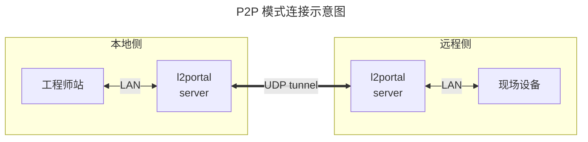
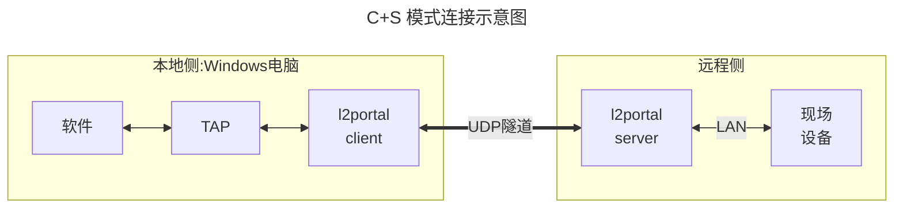
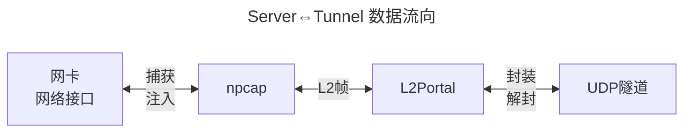
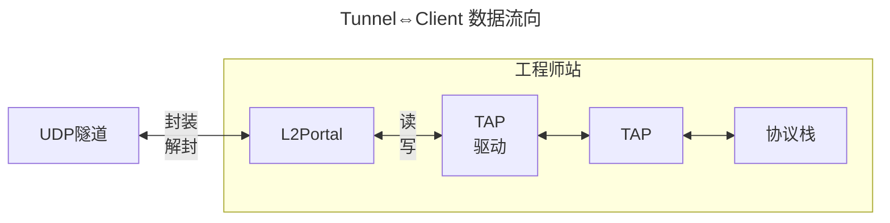
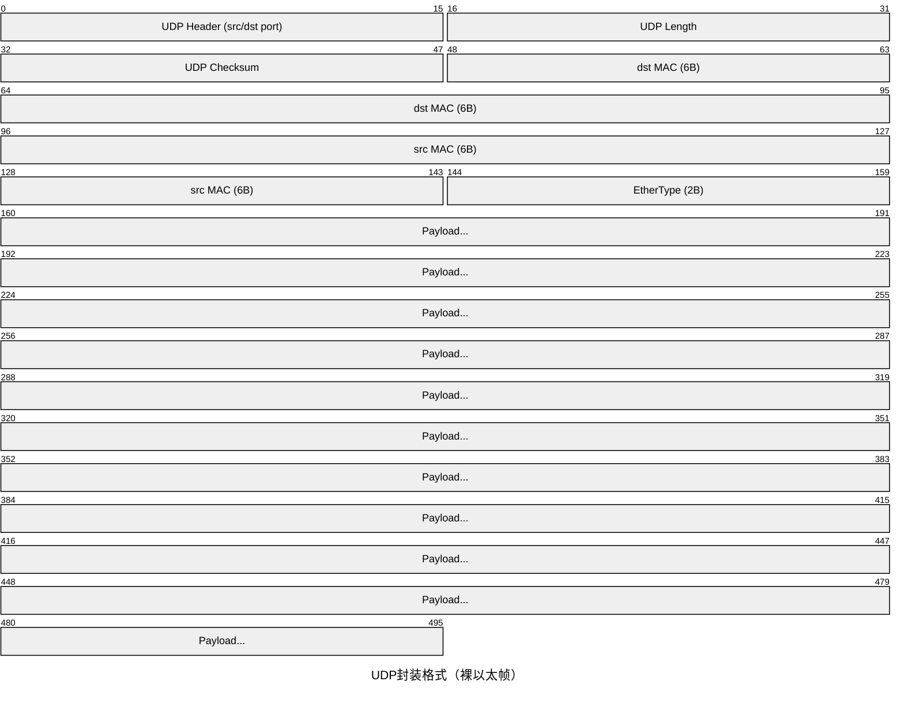
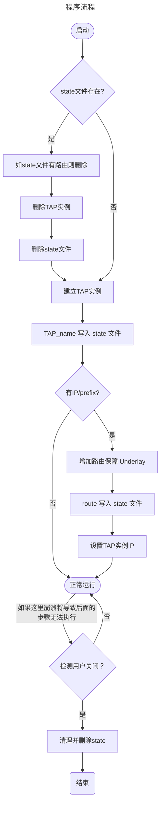

# L2Portal 开发方案

## 1. 背景与目标

开发一个轻量的二层 UDP 隧道工具，将两个网段通过 UDP 隧道透明桥接，使隧道两端的设备能够像接在同一台交换机上一样通讯。

### 指引

- **轻量优先**：无加密、无握手协议，UDP payload 为原始以太帧，封装格式与 l2tunnel 相同（裸以太帧 over UDP），可与其他同类工具互通
- **点对点**：Server 端固定，Client 端可在运行时切换对端 Server（无需重启进程）；不支持一对多
- **不分片**：依赖 TAP 网卡 MTU 限制帧大小，避免超 MTU 帧进入隧道；不在传输层做分片/重组
- **转发所有帧**：Server 模式网卡上的所有帧均转发，混杂模式捕获，不做 MAC 过滤
- **不考虑安全**：无认证、无加密，生产环境请在外层使用 VPN
- **不考虑NAT穿透**：对方IP必须可路由，需要IP发现或打洞等功能请在外层使用 VPN
- **仅 Windows 实现**，Linux 有 VXLAN 等现成工具可用。但可考虑以后实现两侧异构系统
- **程序运行时动态提权**：通过嵌入 `manifest.xml` 声明 `requireAdministrator`，自动触发 UAC
- **TAP 网卡动态实例**：Client 模式程序启动时自动创建 TAP 网卡，退出时自动删除，无需用户手动管理

### 两种部署模式



**P2P 模式（透明桥接）**：两侧各运行一个 server 模式的实例，分别捕获各自的网卡的以太帧，穿过隧道后从对侧 IF 射出，对两端设备完全透明，相当于一根穿越专网或 VPN 的"长网线"。

该模式只支持一对一，不支持一对多，同 l2tunnel 的工作方式一致。



**C+S 模式**：Server 侧为 server 模式的实例，Client 侧运行 client 模式实例。

client 模式相当于把上方右侧 "l2portal + 工程师站"合并到同一台机器，且不会将流量转发送至工程师站所在的 LAN 网络。即 L2 网络数据终结在本机的 TAP 虚拟网卡上，并直接由本机软件消费。

Client 模式额外提供运行时切换对端的能力（无需重启），同时自动管理 TAP 网卡的生命周期。

## 2. 架构设计

### 数据流





### UDP 封装格式

所有帧均以裸以太帧直接作为 UDP payload，无任何自定义头部，与 l2tunnel 兼容：



### 外部依赖

| 依赖 | 类型 | 说明 |
|------|------|------|
| npcap | 系统驱动 | 由安装包静默安装 |
| npcap-sdk | 库 | 开发依赖 |
| TAP-Windows6 | 系统驱动 | 由安装包静默安装 |
| tapctl.exe | TAP接口管理 | 随程序一同部署，运行时依赖 |

最终 `l2portal.exe` 为单一可执行文件，自动触发 UAC 提权，运行时自动创建/删除 TAP 网卡实例。

- npcap 源: https://npcap.com/#download 下载 npcap-x.xx.exe 
- npcap-sdk 源: https://npcap.com/#download 下载 npcap-sdk-x.xx.zip 
- TAP-Windows6 源: https://github.com/OpenVPN/tap-windows6/releases
- tapctl.exe 源: https://openvpn.net/community/ 下载正确 OpenVPN MSI 安装包后单独解压 tapctl.exe

## 3. 命令行接口

CLI 有三种形式：

```
l2portal.exe --list
l2portal.exe --if <IFID> --local <LocalIP:PORT> --remote <RemoteIP:PORT>
l2portal.exe --tap <TAPAdapterName>[:<IP/prefix>] --local <LocalIP:PORT> --remote <RemoteIP:PORT>
```

`--local` 的 IP 部分若填写 `0.0.0.0`，程序在建立隧道前通过系统路由表查询到达 `--remote` IP 的出口接口，取该接口的本地 IP 作为 UDP socket 的实际绑定地址，确保报文源 IP 与路由出口一致。此行为对用户透明，日志中会打印实际绑定的本地 IP。

### 3.1 列出可用网卡

```
l2portal.exe --list
```

输出示例：

```
  ifIdx  名称        描述                                IP
  -----  ----------  ----------------------------------  ---------------
      8  以太网      Realtek PCIe GbE Family Controller  192.168.1.10
     12  WLAN        Intel(R) Wi-Fi 6 AX201              10.0.0.5
```

未配置 IP 的网卡在 IP 列显示 `-`。

`--list` 通过 npcap 的 `pcap_findalldevs` 枚举所有可捕获接口，再与系统路由表（`GetAdaptersInfo`）交叉查询，补全 friendly name、ifIndex 和当前 IP。

`--list` 作为顶层独立命令处理，优先于 `--if`/`--tap` 模式分支匹配，不需要同时传其他参数。

NPF GUID（`\Device\NPF_{xxxxxxxx-xxxx-xxxx-xxxx-xxxxxxxxxxxx}`）是 npcap 内部设备路径，`route print`、`ipconfig` 等常用工具均不直接显示。若需手动查询，可用：

```powershell
Get-NetAdapter | Select-Object Name, InterfaceGuid
```

### 3.2 server 模式

```
l2portal.exe --if <IFID> --local <LocalIP:PORT> --remote <RemoteIP:PORT>
```

`--if` 接受以下三种形式，程序自动识别：

| 形式 | 示例 | 说明 |
|------|------|------|
| Friendly name | `以太网` | 网络设置中显示的名称，**推荐** |
| ifIndex | `8` | list 命令看到的最左侧数字 |
| NPF GUID | `\Device\NPF_{xxxxxxxx-...}` | npcap 内部路径，兜底用 |

示例：

```powershell
# 推荐：用 friendly name
l2portal.exe --if 以太网 `
             --local 0.0.0.0:4789 `
             --remote 203.0.113.10:4789

# 或用 list 命令看到的 ifIdx
l2portal.exe --if 8 `
             --local 0.0.0.0:4789 `
             --remote 203.0.113.10:4789
```

### 3.3 client 模式

```
l2portal.exe --tap <TAPAdapterName>[:<IP/prefix>] --local <LocalIP:PORT> --remote <RemoteIP:PORT>
```

示例（不配置TAP IP，由用户或DHCP自行管理）：

```powershell
l2portal.exe --tap tap-ot `
             --local 0.0.0.0:4789 `
             --remote 203.0.113.1:4789
```

示例（同时给TAP网卡配置静态IP，自动处理隧道底层路由）：

```powershell
l2portal.exe --tap tap-ot:192.168.10.50/24 `
             --local 0.0.0.0:4789 `
             --remote 203.0.113.1:4789
```

运行时切换对端（stdin输入）：

```
switch 203.0.113.20:4789
```

`--tap` 指定的网卡名即为程序自动创建的 TAP 网卡名称，程序退出时按同名删除。

若提供了 `IP/prefix` 部分（`tapname:IP/prefix`），程序会在配置 TAP 网卡 IP 之前自动注入主机路由，确保 Underlay 流量不会被 TAP 网卡接管，防止路由环路。相关实现见 4.4 节。

Client 模式通过监听 stdin 命令支持运行时切换对端，无需重启进程。实现上用 `Arc<RwLock<SocketAddr>>` 存储当前 remote 地址，stdin 任务写入，UDP 发送任务读取，切换原子生效。

## 4. Rust 实现

项目目录如下：

```
📂l2portal/
 ├─📄Cargo.toml
 ├─📄Cargo.lock
 ├─📄build.rs
 ├─📂docs/
 │  ├─📂design/                  # 设计文件
 │  │  └─📄L2Portal-dev-plan.md  # 本文档
 │  └─📂user-guide/
 ├─📄manifest.xml
 ├─📂src/
 │  └─📄main.rs                  # 单一入口，内部分支
 ├─📂deps/
 │  ├─📂tap/
 │  │  ├─📂amd64/                # 该目录下文件都来自 dist.win10.zip
 │  │  │  ├─📄OemVista.inf
 │  │  │  ├─📄tap0901.cat
 │  │  │  ├─📄tap0901.sys
 │  │  │  └─📄devcon.exe         # 安装包调用一次
 │  │  └─📄tapctl.exe            # 从 OpenVPN 安装包提取，部署到目标机
 │  └─📂npcap/
 │     ├─📂installer/
 │     │  └─📄npcap-x.xx.exe
 │     └─📂sdk/
 │        ├─📂Include/
 │        └─📂Lib/
 └─📂installer/
    └─📄setup.iss                # Inno Setup 脚本
```

### 4.1 Crate 依赖

```toml
[package]
name    = "l2portal"
version = "0.1.0"
edition = "2021"

[dependencies]
pcap        = "2"                                      # npcap 封装，捕获+注入物理网卡帧
tap-windows = "0.1"                                    # TAP-Windows6 读写封装
tokio       = { version = "1", features = ["full"] }   # 异步运行时
clap        = { version = "4", features = ["derive"] } # 命令行参数解析
anyhow      = "1"                                      # 错误处理
log         = "0.4"                                    # 日志接口
env_logger  = "0.11"                                   # 日志后端，RUST_LOG=debug/info/warn/error

[target.'cfg(windows)'.dependencies]
windows-sys = { version = "0.59", features = [
    "Win32_Foundation",
    "Win32_NetworkManagement_IpHelper",  # GetIpForwardTable2，用于查询默认路由网关和接口编号
] }

[build-dependencies]
winres = "0.1"                                         # 编译时嵌入 manifest，触发 UAC 提权

[[bin]]
name = "l2portal"
path = "src/main.rs"
```

使用 log + env_logger 作为日志系统，通过 RUST_LOG 环境变量控制级别。通过自定义 Writer 将 INFO 及以上级别同时输出到 stdout 和 stderr，低于 INFO 仅输出到 stderr，格式统一为 `[LEVEL] <模块>: <信息>`。

### 4.2 编译时依赖

编译需要 npcap SDK：

```powershell
$env:LIB     = "l2portal/deps/npcap/sdk/Lib/x64"
$env:INCLUDE = "l2portal/deps/npcap/sdk/Include"
cargo build --release --bin l2portal
```

### 4.3 UAC 提权（manifest.xml）

在项目根目录创建 `manifest.xml`，通过 `build.rs` 在编译时将其嵌入可执行文件。程序双击运行时 Windows 会自动弹出 UAC 确认框，无需在代码中手动调用提权 API。

```xml
<!-- manifest.xml -->
<?xml version="1.0" encoding="UTF-8" standalone="yes"?>
<assembly xmlns="urn:schemas-microsoft-com:asm.v1" manifestVersion="1.0">
  <trustInfo xmlns="urn:schemas-microsoft-com:asm.v3">
    <security>
      <requestedPrivileges>
        <requestedExecutionLevel level="requireAdministrator" uiAccess="false"/>
      </requestedPrivileges>
    </security>
  </trustInfo>
</assembly>
```

```rust
// build.rs
fn main() {
    if std::env::var("CARGO_CFG_TARGET_OS").unwrap_or_default() == "windows" {
        let mut res = winres::WindowsResource::new();
        res.set_manifest_file("manifest.xml");
        res.compile().expect("failed to embed manifest");
    }
}
```

### 4.4 TAP 网卡动态实例（Client 模式）

`tapctl.exe` 支持按名称创建和删除网卡实例，程序通过 `std::process::Command` 调用它，在启动时创建、退出时删除。

#### 启动时创建

```rust
fn tap_create(name: &str) -> anyhow::Result<()> {
    // 残留清理已由启动时的 state_cleanup_residue() 处理，此处直接创建
    let status = Command::new("tapctl.exe")
        .args(["create", "--name", name])
        .status()?;
    anyhow::ensure!(status.success(), "tapctl create failed: {status}");

    // 设置 MTU，确保帧大小不触发底层 IP 分片
    let status = Command::new("netsh")
        .args(["interface", "ipv4", "set", "subinterface",
               name, "mtu=1400", "store=persistent"])
        .status()?;
    anyhow::ensure!(status.success(), "netsh set mtu failed: {status}");

    Ok(())
}
```

#### 退出时删除

```rust
fn tap_delete(name: &str) -> anyhow::Result<()> {
    let status = Command::new("tapctl.exe")
        .args(["delete", "--name", name])
        .status()?;
    anyhow::ensure!(status.success(), "tapctl delete failed: {status}");
    Ok(())
}
```

#### 可靠退出：Ctrl+C 信号处理

正常关闭窗口或 Ctrl+C 时用 `tokio::signal` 捕获，保证清理代码执行：

```rust
// src/main.rs（Client 模式分支）

let tap_name = args.tap.name.clone();
tap_create(&tap_name)?;

// 注册 Ctrl+C / SIGTERM 处理，确保退出时执行完整清理
let tap_name_cleanup = tap_name.clone();
// 有 IP/prefix 时需清理主机路由；路由目的地址为 --remote 参数的 IP 部分
let tap_route_cleanup: Option<Ipv4Addr> = tap_arg.ip_prefix.map(|_| args.remote.ip());
tokio::spawn(async move {
    tokio::signal::ctrl_c().await.ok();
    eprintln!("shutting down, cleaning up...");
    if let Some(ip) = tap_route_cleanup {
        let _ = route_delete_host(ip);
    }
    let _ = tap_delete(&tap_name_cleanup);
    state_remove();
    std::process::exit(0);
});

// ... 其余任务 ...

// main 正常退出时也做完整清理
if tap_arg.ip_prefix.is_some() {
    let _ = route_delete_host(args.remote.ip());
}
tap_delete(&tap_name)?;
state_remove();
```

#### TAP IP 与隧道底层路由注入

当 `--tap` 参数包含 `IP/prefix` 时，即 `--tap tapname:IP/prefix`，程序在启动流程中自动完成路由注入与 IP 配置，并**保证按顺序执行**：

```
tap_create(name)                        // 创建 TAP 网卡实例
  ⇒ route_add_host(remote_ip, gw, idx)  // 先钉 Underlay 路由（目的地 = remote server IP）
  ⇒ tap_set_ip(name, tap_ip, prefix)    // 再配置 TAP 网卡 IP（此时 CIDR 路由建立）
  ⇒ 正常运行
  ⇒ tap_clear_ip(name)                  // 退出时清除 TAP IP
  ⇒ route_delete_host(remote_ip)        // 退出时删除主机路由
  ⇒ tap_delete(name)                    // 删除 TAP 网卡实例
```

**为什么顺序重要**：若先配置 TAP IP，系统会立即建立指向 `tap-ot` 的 CIDR 路由；此后 Underlay 的 UDP 包会被该路由截获并送入 TAP，形成路由环路。提前注入指向 remote server IP 的主机路由，可确保 Underlay 流量不被劫持到 TAP。

```rust
/// 解析 "--tap tap-ot:192.168.10.50/24" 形式的参数
struct TapArg {
    name:      String,
    ip_prefix: Option<(Ipv4Addr, u8)>,  // TAP 网卡本机接口地址 + 前缀长度，如 (192.168.10.50, 24)
}

fn parse_tap_arg(s: &str) -> anyhow::Result<TapArg> {
    if let Some((name, addr_str)) = s.split_once(':') {
        let (ip_str, prefix_str) = addr_str.split_once('/')
            .ok_or_else(|| anyhow::anyhow!("格式应为 IP/prefix，如 192.168.10.50/24"))?;
        let ip: Ipv4Addr = ip_str.parse()?;
        let prefix: u8 = prefix_str.parse()?;
        anyhow::ensure!(prefix <= 32, "prefix 必须 ≤ 32");
        Ok(TapArg { name: name.to_string(), ip_prefix: Some((ip, prefix)) })
    } else {
        Ok(TapArg { name: s.to_string(), ip_prefix: None })
    }
}

/// 第一步：注入 Underlay 路由，钉住 Underlay 流量走的原出口
/// remote_ip 为 --remote 参数指定的对端 server IP
/// 必须在 tap_set_ip 之前调用
fn route_add_host(remote_ip: Ipv4Addr, gateway: Ipv4Addr, if_idx: u32) -> anyhow::Result<()> {
    let status = Command::new("route")
        .args(["add",
               &remote_ip.to_string(), "mask", "255.255.255.255",
               &gateway.to_string(),
               "if", &if_idx.to_string()])
        .status()?;
    anyhow::ensure!(status.success(), "route add host failed: {status}");
    Ok(())
}

/// 第二步：给 TAP 网卡配置静态 IP
fn tap_set_ip(name: &str, ip: Ipv4Addr, prefix: u8) -> anyhow::Result<()> {
    let mask = prefix_to_mask(prefix);
    let status = Command::new("netsh")
        .args(["interface", "ip", "set", "address",
               name, "static", &ip.to_string(), &mask.to_string()])
        .status()?;
    anyhow::ensure!(status.success(), "netsh set ip failed: {status}");
    Ok(())
}

/// 退出时清除 TAP IP（恢复 DHCP 占位，避免网卡删除前触发路由重算）
fn tap_clear_ip(name: &str) -> anyhow::Result<()> {
    let _ = Command::new("netsh")
        .args(["interface", "ip", "set", "address", name, "dhcp"])
        .status();
    Ok(())
}

/// 退出时删除主机路由
fn route_delete_host(remote_ip: Ipv4Addr) -> anyhow::Result<()> {
    let _ = Command::new("route")
        .args(["delete", &remote_ip.to_string(), "mask", "255.255.255.255"])
        .status();
    Ok(())
}

fn prefix_to_mask(prefix: u8) -> Ipv4Addr {
    if prefix == 0 { return Ipv4Addr::new(0, 0, 0, 0); }
    let bits = !0u32 << (32 - prefix);
    Ipv4Addr::from(bits)
}
```

**gateway 与 if_idx 的获取**：程序可从系统路由表读取当前默认路由（`GetIpForwardTable2` Win32 API 或解析 `route print` 输出），取默认路由的网关与接口编号作为主机路由的出口。也可通过 `--local` 参数绑定的本地 IP 反查所属接口。

**退出清理**的调用顺序与启动相反，同样在 Ctrl+C handler 和 main 正常退出两处均需执行。清理过程中若某一步骤失败（如 tapctl delete 返回错误），程序记录 WARN 级日志后继续执行后续清理步骤，不因单步失败中断整体清理流程。

#### 异常退出与残留

任务管理器强杀、系统崩溃等情况下清理代码不会执行，TAP 网卡和主机路由均会残留。TAP 网卡可以通过名称重建，但主机路由（`route add`）没有持久名称，崩溃后无法知道当时注入了哪条路由，必须有外部记录。

程序采用**启动状态文件**统一管理残留清理。文件路径为：

```
%APPDATA%\L2Portal\state
```

文件格式（`key=value`，每行一个字段，无 `IP/prefix` 时 `tap_route` 行缺失）：

```ini
tap_name=tap-ot
tap_route=203.0.113.1
```

`tap_route` 存储的是注入主机路由时的目的地址，即 `--remote` 参数的 IP 部分。



rust 逻辑

```rust
use std::path::PathBuf;
use std::collections::HashMap;

fn state_path() -> PathBuf {
    let appdata = std::env::var("APPDATA").unwrap_or_else(|_| ".".to_string());
    PathBuf::from(appdata).join("L2Portal").join("state")
}

fn state_write(tap_name: &str, tap_route: Option<Ipv4Addr>) -> anyhow::Result<()> {
    let path = state_path();
    std::fs::create_dir_all(path.parent().unwrap())?;
    let mut content = format!("tap_name={}\n", tap_name);
    if let Some(ip) = tap_route {
        // tap_route 为 --remote 参数的 IP 部分，即注入主机路由的目的地址
        content.push_str(&format!("tap_route={}\n", ip));
    }
    std::fs::write(&path, content)?;
    Ok(())
}

fn state_cleanup_residue() -> anyhow::Result<()> {
    let path = state_path();
    let Ok(text) = std::fs::read_to_string(&path) else { return Ok(()); };
    let fields: HashMap<&str, &str> = text.lines()
        .filter_map(|l| l.split_once('='))
        .collect();
    if let Some(&tap_name) = fields.get("tap_name") {
        log::info!("发现残留状态，执行清理: tap={}", tap_name);
        if let Some(&ip_str) = fields.get("tap_route") {
            if let Ok(ip) = ip_str.parse::<Ipv4Addr>() {
                let _ = route_delete_host(ip);
            }
        }
        let _ = tap_delete(tap_name);
    }
    let _ = std::fs::remove_file(&path);
    Ok(())
}

fn state_remove() {
    let _ = std::fs::remove_file(state_path());
}
```

无需额外引入序列化 crate，标准库 `std::fs` 和 `std::collections::HashMap` 即可完成读写。

### 4.5 Server 模式核心逻辑结构

```rust
// src/main.rs（Server 模式分支，--if 参数时进入）
// 注：--list 作为顶层命令优先处理，在进入此分支之前已完成匹配并返回

#[tokio::main]
async fn main() {
    // 1. 解析命令行参数：--list 优先处理（输出网卡列表后退出）；
    //    其次按 --if / --tap 进入对应模式分支
    //    注意：`if` 是 Rust 关键字，clap derive 时须将字段名与参数名分离：
    //      #[arg(long = "if")]
    //      iface: Option<String>,
    //    代码中通过 args.iface 访问，CLI 上仍为 --if
    // 2. --if 接受 friendly name、ifIndex 或 NPF GUID，需先通过
    //    pcap_findalldevs 遍历匹配，将用户输入转换为 pcap 设备名后再调用
    //    Capture::from_device(pcap_device_name)?.promisc(true).open()?
    // 3. 若 --local IP 为 0.0.0.0，通过 GetBestRoute2 查询到达 --remote IP
    //    的出口接口，取该接口本地 IP 作为实际绑定地址，日志打印实际绑定 IP
    // 4. 绑定 UDP socket

    // 任务一：物理IF捕获 -> UDP发送（裸以太帧直接作为 payload）
    tokio::spawn(async move {
        loop {
            let frame = cap.next_packet()?;
            udp_tx.send_to(frame.data, remote).await?;
        }
    });

    // 任务二：UDP接收 -> pcap_inject回物理IF
    tokio::spawn(async move {
        loop {
            let (n, _) = udp_rx.recv_from(&mut buf).await?;
            cap_inject.sendpacket(&buf[..n])?;
        }
    });
}
```

### 4.6 Client 模式核心逻辑结构

```rust
// src/main.rs（Client 模式分支，--tap 参数时进入）

#[tokio::main]
async fn main() {
    // 1. 解析命令行参数（--tap / --local / --remote）
    // 2. 若 --local IP 为 0.0.0.0，通过 GetBestRoute2 查询到达 --remote IP
    //    的出口接口，取该接口本地 IP 作为实际绑定地址，日志打印实际绑定 IP
    // 3. 创建 TAP 网卡（tap_create），注册 Ctrl+C 清理 handler
    // 4. 打开 TAP 设备（tap-windows crate）
    // 5. 绑定 UDP socket
    // 6. remote = Arc<RwLock<SocketAddr>>

    // 任务一：UDP接收 -> WriteFile写TAP（裸以太帧直接写入）
    tokio::spawn(async move {
        loop {
            let (n, _) = udp_rx.recv_from(&mut buf).await?;
            tap_writer.write(&buf[..n]).await?;
        }
    });

    // 任务二：ReadFile读TAP -> UDP发送
    tokio::spawn(async move {
        loop {
            let n = tap_reader.read(&mut buf).await?;
            let remote = *remote_addr.read().await;
            udp_tx.send_to(&buf[..n], remote).await?;
        }
    });

    // 任务三：stdin 监听，运行时切换对端
    tokio::spawn(async move {
        let mut lines = BufReader::new(tokio::io::stdin()).lines();
        while let Some(line) = lines.next_line().await? {
            if let Some(addr_str) = line.strip_prefix("switch ") {
                if let Ok(new_addr) = addr_str.trim().parse::<SocketAddr>() {
                    *remote_addr.write().await = new_addr;
                    log::info!("switched remote to {}", new_addr);
                }
            }
        }
    });

    // 等待：任意任务结束 或 Ctrl+C 信号（事件驱动，非轮询）
    tokio::select! {
        _ = task_udp_rx   => { log::warn!("UDP接收任务意外退出"); }
        _ = task_tap_read => { log::warn!("TAP读取任务意外退出"); }
        _ = task_stdin    => { log::info!("stdin关闭，准备退出"); }
        _ = tokio::signal::ctrl_c() => { log::info!("收到Ctrl+C，准备退出"); }
    }

    // 任一分支触发后执行一次性清理
    tap_clear_ip(&tap_name).ok();
    route_delete_host(remote_ip).ok();
    tap_delete(&tap_name).ok();
    state_remove();
}
```

### 4.7 安装包打包（Inno Setup）

使用 Inno Setup 制作单一 `.exe` 安装包。安装包负责完成所有依赖的一次性安装，以及将程序本体和运行时工具部署到目标机器。

#### 打包内容

安装包需包含以下文件：

- `deps/npcap/installer/npcap-1.75.exe`：npcap 安装程序，安装阶段静默调用
- `deps/tap/amd64/`（`OemVista.inf`、`tap0901.cat`、`tap0901.sys`）：TAP 驱动文件，安装阶段通过 `devcon.exe` 静默安装
- `deps/tap/devcon.exe`：驱动安装及卸载工具，部署到目标机安装目录，供安装与卸载阶段调用
- `target/release/l2portal.exe`：程序本体，部署到目标机安装目录
- `deps/tap/tapctl.exe`：TAP 实例管理工具，与 `l2portal.exe` 一同部署到安装目录

#### 依赖存在性检测

安装时各依赖的安装步骤均应先检测是否已存在，已存在则跳过，避免重复安装或覆盖用户现有版本。检测方式如下：

**npcap**：npcap 安装后会在注册表 `HKLM\SOFTWARE\WOW6432Node\Npcap` 下写入版本信息，Inno Setup 可通过读取该注册表键判断是否已安装。键存在则跳过，否则静默运行 `npcap-1.75.exe /S`。

**TAP-Windows6 驱动**：驱动安装后，`tap0901.sys` 会被复制到系统驱动目录 `%SystemRoot%\System32\drivers\`。Inno Setup 检查该文件是否存在即可判断驱动是否已安装。文件存在则跳过，否则调用 `devcon.exe install amd64\OemVista.inf tap0901` 静默安装驱动。

#### 安装步骤顺序

```
1. 检测 npcap 是否已安装（查注册表）
    → 未安装：静默运行 npcap-1.75.exe /S
    → 已安装：跳过

2. 检测 TAP 驱动是否已安装（查 drivers\tap0901.sys）
    → 未安装：静默运行 devcon.exe install amd64\OemVista.inf tap0901
    → 已安装：跳过

3. 复制 l2portal.exe、tapctl.exe 和 devcon.exe 到安装目录

4. 将安装目录加入系统 PATH
```

#### 安装目录建议

建议默认安装到 `C:\Program Files\L2Portal\`，安装包同时创建开始菜单快捷方式（可选）。`tapctl.exe` 与 `l2portal.exe` 放在同一目录。程序运行时优先从 `l2portal.exe` 所在目录查找 `tapctl.exe`，若不存在则 fallback 到系统 PATH。

#### 卸载

卸载程序仅删除 L2Portal 自身的文件和安装目录，**默认不卸载第三方依赖**（npcap、TAP-Windows6）。

原因：这两个驱动均会出现在系统「控制面板 → 程序和功能」列表中，用户可随时手动卸载；且它们可能被 Wireshark、OpenVPN 等其它软件共用，强制卸载存在破坏其它软件的风险。

卸载确认页面提供两个可选勾选项，**默认均不勾选**：

```
[ ] 同时卸载 Npcap
    （如其它软件（如 Wireshark）也在使用，请勿勾选）

[ ] 同时卸载 TAP-Windows Adapter
    （如其它软件（如 OpenVPN）也在使用，请勿勾选）
```

Inno Setup 实现要点：

- 在 `[UninstallRun]` 中按勾选结果条件执行卸载命令
- npcap 的静默卸载：读取注册表 `HKLM\SOFTWARE\WOW6432Node\Npcap\UninstallString` 后加 `/S` 参数执行
- TAP-Windows6 的静默卸载：调用安装目录下的 `devcon.exe remove tap0901` 移除驱动

## 5. 关键技术说明

npcap 本身是一个 NDIS 6 LWF（Lightweight Filter Driver），串联在现有网卡的协议栈上。本程序通过 npcap-sdk（libpcap API）调用它，**不需要自行开发内核驱动，不需要 WHQL 认证**。Server 模式物理网卡的 IP 配置、路由、正常流量完全不受影响，npcap 以旁路方式工作。

TAP-Windows6 是一个 NDIS 虚拟 miniport 驱动（模拟网卡），已有微软 WHQL 签名，不需要自行开发。用户态程序通过 `CreateFile` 打开 `\\.\Global\tap-ot.tap` 获得文件句柄，用 `ReadFile`/`WriteFile` 直接读写以太帧：

```
WriteFile(tap_handle, frame)
    -> NDIS miniport RX 路径
    -> Windows TCP/IP 协议栈
    -> 应用程序 socket
```

Server 模式 npcap 必须以混杂模式（`promisc=true`）打开网卡，否则默认只捕获目标 MAC 是本机的帧。OT 网络中大量单播帧的目标是现场设备，不开混杂模式会漏掉这些帧。

## 6. 其它

- **TAP 动态实例验证**：验证程序启动/退出时 TAP 网卡自动创建/删除；强杀进程后重启，验证残留 TAP 网卡和主机路由均通过 `state` 自动清理，state 文件在正常退出后消失
- **Server 模式单向验证**：物理IF捕获 -> UDP发送，Client 端用 Wireshark 确认收到原始以太帧
- **Client 模式单向验证**：UDP接收 -> WriteFile写TAP，Client 端 Wireshark 抓 tap-ot 确认帧进入协议栈
- **双向联通**：两个方向同时跑，ping + ARP 测试
- **Client 模式切换测试**：运行时 switch 命令，验证切换后无需重启即可正常转发
- **OT 软件验证**：实际软件上线，验证广播发现、协议握手
- **解决IP同段验证**：使用 `--tap tap-ot:<IP>/<prefix>` 启动，验证路由自动注入、TAP IP 正确配置、同网段访问无路由环路，以及退出后路由和 TAP 均清理干净
